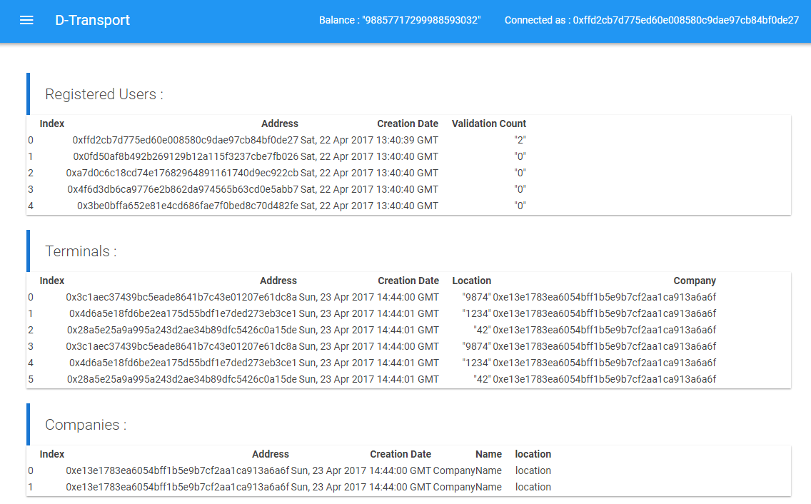

# d-transport-website

D-Transport website is an administration website for [D-Transport smart contract](https://github.com/D-Transport/smart-contract).
- Visualize datas stored in the smart contract (Companies, Terminals and Users)
- Interact and call smart contract functions

## Deploy D-Transport smart contracts
``` bash
# make sure you have truffle and testrpc installed globally
npm install -g truffle
npm install -g ethereumjs-testrpc

# launch testrpc
testrpc

# deploy
cd smart-contract
truffle migrate
```
Get the returned contract address and change it in `/src/config/DTransport.js`

## Build and Run the app

``` bash
# install dependencies
npm install

# serve with hot reload at localhost:8080
npm run dev

# build for production with minification
npm run build

# build for production and view the bundle analyzer report
npm run build --report
```

## Load fixtures
To import fixtures datas, navigate to http://localhost:8080/#/fixtures



